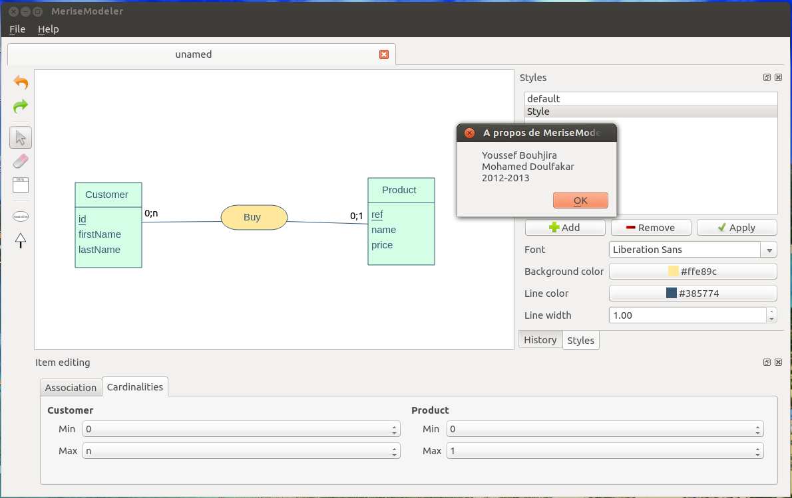

MeriseModeler
=============

Notre projet de fin d'études à l'Ecole supérieure de Technologie d'Essaouira.
C'est logiciel qui permet de dessiner des modèles conceptuelle de données
Merise, développé en C++ et Qt Framework.

